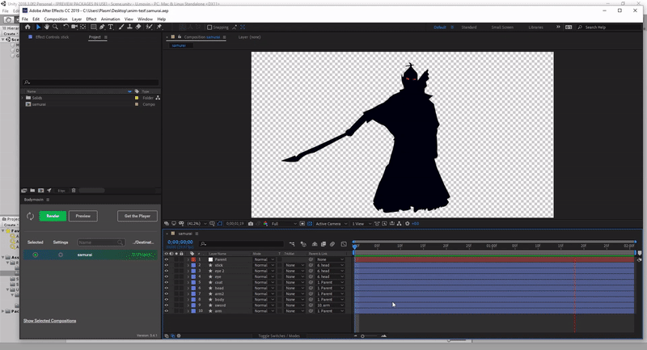

# u.movin


## Unity animated vector graphics from After Effects shapes.

Inspired by [Lottie](https://github.com/airbnb/lottie-web) frameworks that take animation data from After Effects to create animated vector sequences for web/mobile. With the help of the [Vector Graphics](https://docs.unity3d.com/Packages/com.unity.vectorgraphics@1.0/manual/index.html) package, this library aims to bring [the same](https://www.lottiefiles.com/) and more to Unity.

## Features

While not yet utilizing all AE attributes and properties, this library currently supports animation for: 

- Shape paths
- Shape fill color
- Shape stroke color
- Layer anchor points
- Layer position
- Layer rotation (X, Y, Z)
- Layer scale
- Layer opacity 
- Blending between compositions
- Single layer precompositions **[IN PROGRESS]**


## Examples




## Usage

**First**, have the [Bodymovin extension](https://creative.adobe.com/addons/products/12557) for After Effects to export your composition.

**Second**, enable the [Vector Graphics](https://docs.unity3d.com/Packages/com.unity.vectorgraphics@1.0/manual/index.html) preview package from the **Package Manager** in Unity.

**Third**, add the **json** [exported from Bodymovin](https://www.youtube.com/watch?v=5XMUJdjI0L8) to your Resources folder. 


###### Editor

Add a **Movin Renderer** component to your GameObject and set the **resourcePath** to point to your json file **(located under 'Resources')**


###### Script instantiation

```
Movin mov = new Movin(transform, "json/samurai");
mov.Play();
```

The first parameter is the transform that will contain the shapes, the second is the path to json file **(located under 'Resources')**

## TODO

- Concurrent playing composition blending
- Nested Precomps
- Masking / Alpha Mattes
- Parametric shapes
- Stroke size, width, opacity
- Fill opacity
- Time remapping
- Animating bitmap layers
- Blend mode support